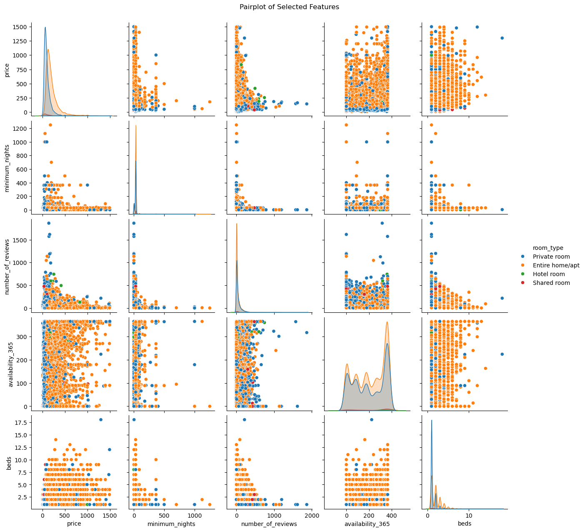

# NYC Airbnb Market Analysis 2024

## Project Overview
This project presents a comprehensive analysis of New York City's Airbnb market using data from 2024. The analysis focuses on understanding market dynamics, pricing patterns, and factors that influence listing success in NYC's competitive short-term rental market.



## Objectives
- Analyze price variations across different neighborhoods and boroughs
- Identify key factors that contribute to successful Airbnb listings
- Discover the best value accommodations in different areas
- Understand host behavior and listing optimization strategies
- Examine the relationship between reviews, prices, and availability

## About Dataset
The analysis is based on the NYC Airbnb dataset from 2024, containing:
- 20,765 unique listings
- 22 features including:
  - Location data (neighborhood, borough, coordinates)
  - Pricing information
  - Host details
  - Review metrics
  - Availability data
  - Property characteristics

## Workflow
1. **Data Cleaning and Preprocessing**
   - Handling missing values
   - Converting data types
   - Removing outliers
   - Feature engineering

2. **Exploratory Data Analysis**
   - Price distribution analysis
   - Location-based insights
   - Host performance metrics
   - Review analysis
   - Availability patterns

3. **Visualization and Insights**
   - Interactive maps
   - Statistical plots
   - Correlation analysis
   - Trend identification

## Insights
1. **Price Analysis**
   - Manhattan commands premium prices
   - Brooklyn offers better value for money
   - Strong correlation between location and price
   - Seasonal price variations

2. **Location Insights**
   - Most popular neighborhoods
   - Price-to-value ratios
   - Availability patterns
   - Market saturation levels

3. **Host Performance**
   - Review impact on success
   - Host experience metrics
   - Multiple listing analysis
   - Response rate importance

4. **Market Trends**
   - Room type distribution
   - Availability patterns
   - Booking frequency
   - Market saturation indicators

## How to Run This Project

1. Clone this repository:
```bash
git clone [your-repo-url]
```

2. Install the required packages:
```bash
pip install -r requirements.txt
```

3. Open the Jupyter notebook:
```bash
jupyter notebook
```

## What I Learned
Through this analysis, several key findings emerged:
- Manhattan has the highest average prices, but Brooklyn offers better value for money
- Entire homes/apartments are the most common type of listing
- Reviews and response rates significantly impact listing success
- Some neighborhoods show signs of market saturation
- Price optimization varies significantly by location and property type
- Host experience and response time are crucial for success
- Availability patterns affect pricing and review rates

## Contact Me
- **LinkedIn**: [Mahmoud Elnagar](https://linkedin.com/in/elnagar74)
